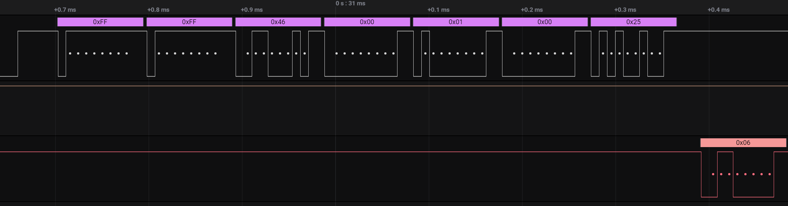
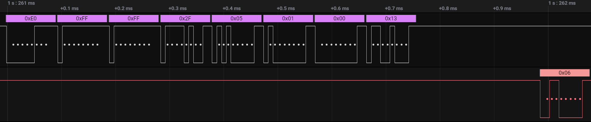

An attempt in reverse engineering the interactions between the FT-891 transceiver and panel (control head).


### FT-891 Serial Communications

Between panel and the transceiver:
* UART (idle high).
* 115200bps 8N2 (8 bits, no parity, 2 stop bits).

### Communication example between the radio and control panel


* VFO Frequency is encoded as 4 Bit BCD.
* Commands seem to be 4 bytes?
* Panel commands that interact with the radio seem to start with `0xE0` & `0xFF`
  * Wakeup routine to check if the radio is ready for commands?
* Certain buttons do not give commands to the radio, e.g: `LOCK` (needs to be explored further).
* Pressing a button seems to give back a data frame with all of the panels button states.
* TODO: Document commands / Volume is `0x93`? (Add section on this).


VFO A/B example:
`0x46 [? Data value?]`


RF GAIN (turning down one step):


---

#### Pressing the A/B button (details):

Note: Panel & Transceiver might be the wrong way around here, not 100% sure what is what yet..

Panel: 
```hexdump
0xE0    ; Wakeup / Enable?
0xFF    ; Wakeup Enable?
0xFB 
0x6C 
0x00 
0x01 
0x00 
0x47
```
Transceiver: 

```hexdump
0x06    ;ACK
```

Panel:
```hexdump
0xE0
0xFF
0xFF
0x6C
0x00
0x01
0x00
0x4B
```

Transceiver:

```hexdump
0x06    ;ACK
0x20
0x01
0x01
0x01
0x00
0x91    ; Button (In this case A/B, however 0x091 is for all panel buttons?)
0x62    ; Part of the button press sequence
0x01
0x08
0x00
0x00
0x00
0x00
0x02
0x00
0x00
0x00
0x20
0x41
0x20
0xF0    ;Inquire VFO A frequency (it's set to 18.151.000 MHz)
0x18    ;18  MHz
0x15    ;15  MHz
0x10    ;1   MHz
0x00    ;00 4Bit BCD
0x20
0x20
0x20
0x20
0x20
0x20
0x20
0x20
0x20
0x20
0x20
0x20
0xF0    ;Inquire VFO B? (It's set to 14.006.000 MHz)
0x14    ;14 MHz
0x00    ;00
0x60    ;6
0x00    ;00 4Bit BCD
```
This is still a part / continuation of the same data exchange as above (from the radio to the panel) , I just have no idea what it is:
```hexdump
0x20 0x20 0x20 0x20
0x20 0x20 0x20 0x20
0x20 0x20 0x20 0x20
0x20 0x20 0x20 0x00
0x00 0x00 0x00 0x00
0x00 0x00 0x00 0xC0
0x50 0x52 0x43 0x00    ; IPO 
0x00 0x00 0x00 0x00
0x00 0x00 0x00 0x00
0x00 0x00 0x00 0xC0
0x49 0x50 0x4F 0x00
0x00 0x00 0x00 0x00
0x00 0x00 0x00 0x00
0x00 0x00 0x00 0x00
0x00 0x00 0x00 0x03
0x53 0x50 0x4C 0x20    ; SPL (0x53, 0x50, 0x4C)
0x20 0x03 0x57 0x44    ; WDH (0x57, 0x44, 0x48)
0x48 0x20 0x20 0x03
0x53 0x50 0x44 0x20
0x20 0x03 0x43 0x4C    ; SPD, CLA
0x41 0x20 0x20 0x00
0x00 0x00 0x00 0x00
0x00 0x00 0x00 0x00
0x00 0x00 0x00 0x00
0x00 0x00 0x00 0x00
0x00 0x00 0x00 0x00
0x00 0x00 0x00 0x00
0x00 0x00 0x00 0x20
0x20 0x20 0x20 0x20
0x20 0x20 0x20 0x20
0x20 0x20 0x20 0x20
0x20 0x20 0x20 0x00
0x00 0x00 0x00 0x00
0x00 0x00 0x00 0x00
0x00 0x00 0x00 0x00 
```


#### LOCK Button:
This example strays from what has been documented & collected so far:
1. No wakeup / preamble bytes (plausible if the lockout is handled _only_ by the panel itself?)
2. No bytes from panel (or radio?) except `0x06` at the very bottom.

```hexdump
; Transceiver or Panel (data from panel is on the bottom only ack?)
0x20 0x01 0x01 0x01
0x00 0x91 0x62 0x01
0x08 0x00 0x00 0x00
0x00 0x02 0x00 0x00
0x00 0x20 0x41 0x20
0xF0 0x18 0x15 0x10
0x00 0x20 0x20 0x20
0x20 0x20 0x20 0x20
0x20 0x20 0x20 0x20
0x20 0xF0 0x14 0x00
0x60 0x00 0x20 0x20
0x20 0x20 0x20 0x20
0x20 0x20 0x20 0x20
0x20 0x20 0x20 0x20
0x20 0x00 0x00 0x00
0x00 0x00 0x00 0x00
0x00 0xC0 0x50 0x52
0x43 0x00 0x00 0x00
0x00 0x00 0x00 0x00
0x00 0xC0 0x4C 0x43
0x4B 0xC0 0x49 0x50
0x4F 0x00 0x00 0x00
0x00 0x00 0x00 0x00
0x00 0x00 0x00 0x00
0x00 0x00 0x00 0x00
0x00 0x03 0x53 0x50
0x4C 0x20 0x20 0x03
0x57 0x44 0x48 0x20
0x20 0x03 0x53 0x50
0x44 0x20 0x20 0x03
0x43 0x4C 0x41 0x20
0x20 0x00 0x00 0x00
0x00 0x00 0x00 0x00
0x00 0x00 0x00 0x00
0x00 0x00 0x00 0x00
0x00 0x00 0x00 0x00
0x00 0x00 0x00 0x00
0x00 0x00 0x00 0x00
0x00 0x20 0x20 0x20
0x20 0x20 0x20 0x20
0x20 0x20 0x20 0x20
0x20 0x20 0x20 0x20
0x20 0x00 0x00 0x00 
0x00 0x00 0x00 0x00
0x00 0x00 0x00 0x00
0x00 0x00 0x00 0x0F

0x06  ; ACK from panel? / radio?
```
